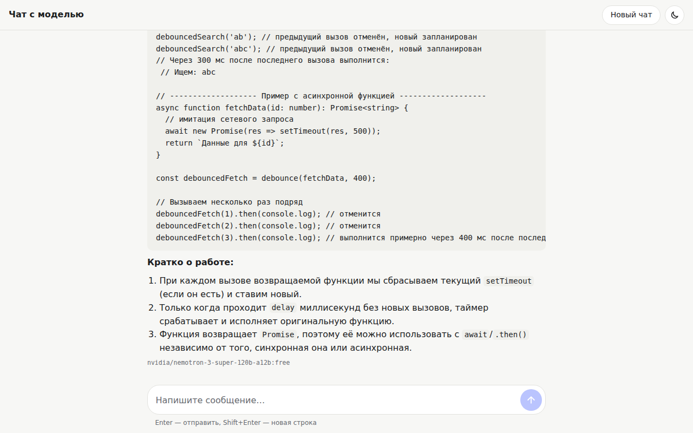
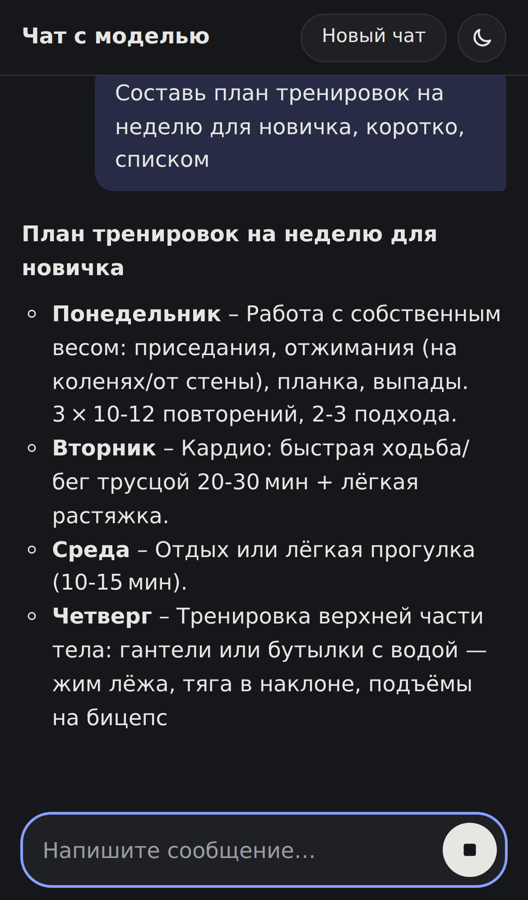
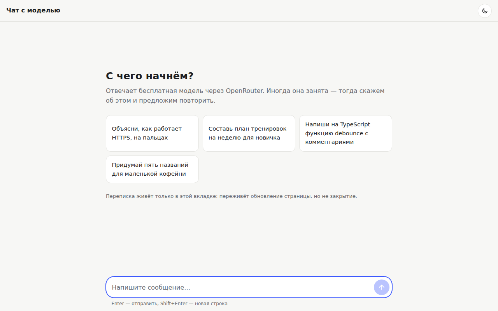
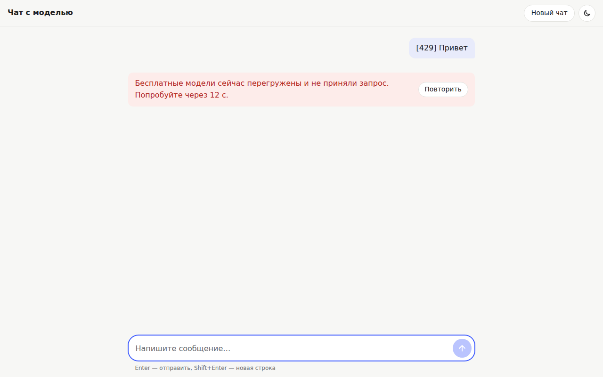

# openrouter-chat

Одностраничный чат с бесплатной моделью OpenRouter. Ответ печатается по мере генерации, его можно остановить на середине, ошибки объясняются словами. Ключ OpenRouter живёт только на сервере.

React 19 + TypeScript + Vite на клиенте, Node без фреймворков на сервере (`node:http`, около 370 строк без тестов).

<p>
  
  
</p>

<details>
<summary>Ещё: экран до первого сообщения и ошибка 429</summary>




Ошибка снята на фейковом OpenRouter из e2e-тестов: метка `[429]` в сообщении говорит ему, какой сбой изобразить. Остальные скриншоты сняты с настоящей моделью.
</details>

## Запуск за пять минут

Нужен Node 22.18 или новее: сервер написан на TypeScript и запускается без сборки.

```bash
git clone <этот репозиторий> && cd openrouter-chat
npm ci
cp .env.example .env        # впишите OPENROUTER_API_KEY (https://openrouter.ai/settings/keys)
npm run build && npm start  # → http://localhost:8787
```

Для разработки: `npm run dev`. Поднимается API на 8787 и Vite на 5173 с hot reload, `/api` проксируется на сервер.

Тесты:

```bash
npm test                    # сервер (node:test) + клиент (vitest), без сети
npm run e2e -w web          # Playwright: десктоп и телефон, против фейкового OpenRouter
```

То же самое, вместе с проверкой типов и линтером, гоняет GitHub Actions на каждый PR (`.github/workflows/ci.yml`). Ключ OpenRouter для CI не нужен.

## Как устроено

```
браузер ──POST /api/chat──▶ наш сервер ──stream──▶ OpenRouter
        ◀── SSE: meta / thinking / retry / delta / done / error ──┘
```

**Ключ.** Браузер знает только `/api/chat`. Ключ читается сервером из `.env` и уходит одним заголовком в OpenRouter. Проверено в браузере: Playwright записал все запросы страницы за сеанс с настоящей моделью, ни одного на openrouter.ai; в собранном бандле нет ни ключа, ни префикса `sk-or`. Ответы OpenRouter при неверном ключе в браузер не пробрасываются: пользователь видит «сервис временно не работает», подробности остаются в логе сервера. На это есть тест.

Чтобы наш сервер не превратился в бесплатный прокси к чужому ключу, есть две защиты: запрос принимается только как `application/json`, поэтому чужой сайт упрётся в CORS preflight, на который мы не отвечаем; и стоит лимит 20 запросов в минуту на IP. Для публичного деплоя этого мало, об этом ниже.

**Стриминг.** Свой маленький протокол поверх SSE, а не сырой поток OpenRouter. Браузеру не нужно знать про `choices[0].delta`, reasoning-токены и форматы ошибок конкретного провайдера. Один парсер SSE (`shared/sse.ts`) используется с обеих сторон и покрыт тестами на разрывы посреди события и CRLF, разрезанный между чанками. `EventSource` не подходит, потому что не умеет POST, поэтому клиент читает `fetch` через reader.

Сервер не отправляет заголовки, пока не придёт первое событие. Благодаря этому 429 от OpenRouter до начала ответа видно в DevTools как настоящий 429 с `Retry-After`, а не как 200 с ошибкой внутри.

**Отмена.** Стоп в браузере → `AbortController` рвёт fetch → на сервере срабатывает `res.on('close')` → обрывается запрос к OpenRouter. Модель не продолжает генерировать впустую. Уже пришедший текст остаётся в истории с пометкой «остановлено» и идёт в контекст следующего вопроса.

**Ошибки.** Каждая заканчивается сообщением и кнопкой «Повторить», вечного спиннера нет:

| Что случилось | Где ловим | Что видит человек |
|---|---|---|
| 429 бесплатной модели | сервер, статус OpenRouter | «модели перегружены, попробуйте через N с» |
| модель молчит | сервер: 20 с до первого токена (размышления считаются), 30 с тишины потом | сначала вопрос уходит следующей модели; если молчат все, «модель слишком долго молчит» |
| модель упала до первого слова (429, 504 посреди размышлений) | сервер | «модель не ответила, спрашиваем другую…», затем ответ запасной модели |
| соединение умерло молча | клиент: 45 с без единого байта после открытия потока (сервер шлёт ping каждые 15 с), 75 с до ответа сервера | то же, таймаут |
| поток оборвался без `done` | сервер и клиент | «ответ прервался», начало ответа сохраняется |
| офлайн / сервер недоступен | клиент | «нет подключения» / «не удалось связаться с сервером» |
| прокси перед нами вернул HTML вместо JSON | клиент | «связь с моделью оборвалась» |

**Запасные модели.** В `.env` задаётся список моделей. Работает на двух уровнях. OpenRouter сам переходит к следующей модели, если первая отказала до начала потока. Этого мало: в живой проверке nemotron на длинном вопросе «думал» так долго, что OpenRouter прислал 504 уже внутри открытого потока, и его собственный фолбэк не сработал. Поэтому сервер сам повторяет вопрос на следующей модели, если текущая упала до первого видимого слова, и не больше трёх попыток. Модели, на которые OpenRouter уже переключался, повторно не спрашиваются. Когда текст уже на экране, модель не меняется: ответ сменил бы голос на середине, так что показываем ошибку и кнопку «Повторить».

Если попытка упала раньше, чем браузер что-то получил, повтор идёт молча, и при полном провале браузер видит настоящий HTTP-статус. Бюджеты согласованы: сервер тратит до первого события не больше 3 × 20 с, а клиент ждёт ответа 75 с.

Модель по умолчанию выбрана по замеру, а не по названию. Первый токен у nemotron и nex приходит за 1–1,6 с, но nemotron отвечает полнее и точнее. Gemma во время проверки стабильно отдавала 429 и стоит последней.

**История.** Хранится в `sessionStorage`. Переживает F5 и падение вкладки, но не её закрытие. Почему так:
- без сохранения случайный F5 посреди разговора стирает всё, а это самая частая потеря;
- `localStorage` оставил бы переписку на общем компьютере навсегда. Люди пишут в чат личное, а кнопки «очистить» в явном виде не ждут;
- на экране до первого сообщения написано прямо: «переживёт обновление страницы, но не закрытие».

Ответ, который печатался в момент перезагрузки, возвращается со статусом «остановлено», а не висит в вечном «печатает». Сохраняем не на каждый токен, а когда ответ завершился и на `pagehide`.

**Клавиатура и доступность.** Enter отправляет, Shift+Enter переносит строку. Enter, которым подтверждают выбор в IME (китайский, японский), не отправляет. Esc останавливает генерацию, где бы ни был фокус. «Отправить» и «Стоп» это одна кнопка, которая меняет роль: если бы кнопки подменяли друг друга, фокус терялся бы в момент начала и конца генерации. По той же причине вместо `disabled` стоит `aria-disabled`. Сообщения размечены списком `<ol>`. Для скринридера есть отдельная строка статуса («модель печатает», «ответ получен»), иначе он зачитывал бы каждый токен.

**Мелочи, которые заметно влияют на ощущение:** перерисовка не чаще раза в кадр, а не на каждый токен (иначе markdown перепарсивался бы сотни раз в секунду); автоскролл за ответом, но только если человек сам не прокрутил вверх почитать; на телефоне поле ввода не получает фокус само, чтобы клавиатура не закрывала экран с подсказками; размер шрифта в поле 16px, иначе iOS зумит страницу при фокусе. Reasoning-модели сначала «думают» молча, и для этого случая индикатор пишет «модель думает…».

## Что я сделал не так, как написано в задании

**Обводку фокуса не убрал.** В задании просят убрать стандартный `outline` у кнопок и поля. Без него человек с клавиатуры не видит, где находится, а задание в соседнем пункте требует, чтобы интерфейсом можно было полноценно пользоваться с клавиатуры. Это ещё и нарушение WCAG 2.4.7 (Focus Visible). Настоящая проблема здесь в том, что обводка в разных браузерах выглядит разнобойно. Поэтому я убрал браузерную и сделал одну свою: одинаковое кольцо в цвет интерфейса, которое появляется только при навигации с клавиатуры (`:focus-visible`). По клику мышью его не видно, так что «аккуратный вид» сохранён. У поля ввода подсвечивается вся рамка, а не сам textarea. Отдельный e2e-тест проходит Tab'ом по всем элементам и проверяет, что фокус виден на каждом.

**Ошибки провайдера не показываю как есть.** Прямо этого не требовали, но упомяну: текст ошибок OpenRouter технический и рассказывает о нашей настройке (ключ, модели). Браузер получает только код, а человек видит объяснение.

## Что бы сделал, будь ещё день

- **Перебор моделей по свежей статистике**: какая чаще отдаёт 429 или долго думает, та уходит в конец списка без правки `.env`.
- **Деплой.** Сейчас это локальный сервис. Для публичного адреса нужны `X-Forwarded-For` от доверенного прокси в лимите (сейчас лимит считается по адресу сокета), общий лимит на ключ, а не только на IP, и, скорее всего, простая защита от ботов.
- **«Продолжить» после Стопа.** Сейчас остановленный ответ остаётся как есть, и продолжить разговор можно только новым сообщением.
- **Редактирование и перегенерация** последнего вопроса, копирование ответа, подсветка синтаксиса в блоках кода (сейчас код моноширинный, но без цветов).
- **Выбор модели в интерфейсе** из живого каталога `:free`: бесплатные модели появляются и исчезают, одна из них пропала прямо во время работы над заданием.

## ИИ-лог

**Инструменты.** Claude Code (модель Claude Opus 5.5) в терминале: план, большая часть кода, тесты, прогоны в браузере через Playwright. Моя часть: постановка задачи, ревью решений и приёмка. Живые проверки шли против настоящего OpenRouter.

**Где ИИ ошибался и как это заметили:**

1. **Выдуманная модель.** ИИ взял `meta-llama/llama-3.3-70b-instruct:free` по памяти, OpenRouter ответил 404: бесплатной версии больше нет. Заметили на первом же curl. С тех пор модели берём только из живого каталога `/api/v1/models`.
2. **Тест, который ничего не проверял.** Тест «Стоп в браузере обрывает запрос к OpenRouter» прошёл с первого раза, и это показалось подозрительным. Я сломал код специально (убрал обработчик `close`), а тест остался зелёным: запрос к фейковому OpenRouter всё равно обрывался через 200 мс по таймауту тишины, а тест ждал 500 мс. Поправили: тест идёт на отдельном сервере с таймаутами 60 с, после этого поломка роняет его. Дальше такую проверку («сломай код, и тест должен упасть») делали для всех важных тестов: остановки в интерфейсе и сброса сторожевого таймера на клиенте.
3. **Второй такой же случай.** Юнит-тест таймаута на клиенте проходил, даже если убрать сброс таймера на ping. Проверка «сломай код» это показала. В тест добавлено условие: на 88-й секунде при ping'ах каждые 44 с ответ ещё не должен завершиться.
4. **Мок, который вёл себя не как браузер.** В моке `fetch` отмена делала `body.cancel()`, но у уже читаемого потока это ничего не делает, и два теста висели до таймаута. Настоящий `fetch` при отмене роняет чтение с `AbortError`. Мок исправили, код менять не пришлось.
5. **Типы для Node в браузерном конфиге.** Папка `shared/` подключена к клиентскому `tsconfig` вместе с тестами на `node:assert`, и сборка упала. Тесты исключены из клиентской сборки.
6. **Vitest подхватил Playwright-спеки.** `npm test` на клиенте падал, потому что vitest пытался запустить e2e-файлы. Заметили на полном прогоне всех тестов, до этого каждый набор гоняли по отдельности. Vitest ограничен `src/`.
7. **Предложил лечить не то.** Когда nemotron на длинном вопросе упал с 504, ИИ сначала предложил поставить первой «быструю» модель. Замер времени до первого токена показал, что скорость у моделей почти одинаковая. Реальная причина была в другом: после открытия потока запасных моделей не было. Модель по умолчанию оставили, добавили повтор на сервере.
8. **Тест на гонки, который ничего не ловил.** Первый вариант проверял двойной Enter и «Новый чат» во время ответа. Проверка «сломай код» показала: тест зелёный и без защиты в `send()`, и без отмены запроса в `reset()`. Двойной Enter интерфейс гасит раньше, потому что поле очищается после первой отправки, а сообщения исчезали с экрана, даже когда запрос к модели продолжал идти. Переписали: теперь тест ждёт, что `/api/chat` реально оборвался, и проверяет гонку, которой можно достичь из интерфейса: «Повторить» на старой ошибке, пока идёт новый ответ.
9. **Первый коммит не собирался.** В каркасе проекта остались импорты файлов шаблона Vite (`index.css`, картинки), самих файлов в коммите не было. Сборка на рабочей копии это не показывала. Нашли, когда перед CI собрали каждую ветку отдельно. Поскольку ничего ещё не было опубликовано, каркас поправили и переставили на него ветки. Теперь каждая ветка, которая уходит в PR, собирается и проходит тесты сама по себе.
10. **Ошибки в самом процессе работы.** `pkill -f server/src/index.ts` совпал с командной строкой собственной оболочки ИИ и убил её, со следующей попыткой через `ps | grep` было то же самое. Перешли на pid-файл. Тест видимости фокуса падал из-за самого теста: после `blur()` Chrome не знает, откуда начинать Tab, а `console.log` внутри `page.evaluate` уходит в консоль браузера, а не в вывод теста. Стартовую точку теперь задаёт клик по заголовку, как сделал бы человек.
